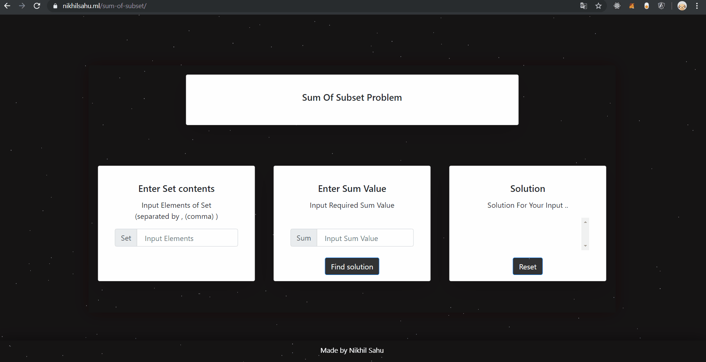

<h1 align="center">Sum of Subset Problem   </h1>
<h3 align="center"> Implementation of this Backtracking Algorithm in JavaScript  <h3>
<h4 align="center">Live @ <a href="https://nikhilsahu.ml/sum-of-subset/">https://nikhilsahu.ml/sum-of-subset/</a>   </h4>   

<div align="center">
  

[](https://nikhilsahu.ml/sum-of-subset/)


</div>

## About 
- DAA Assignment for Sum of Subset Problem .

### Sum Of Subset Problem
-  Sum of Subset problem is to find Subset of elements from a given Set whose Sum adds up to a given number K. 
- Set Contains non-negative values. 

### Algorithm
 - SubsetFind(set, subset, n, subSize, total, node, sum)
    - Input : Given Set , Subset, Size of Set & Subset , Total Sum of Subset , No of Elements in Subset , Required Sum
     - Output : Display all possible Subset present .
    
    ```
    Begin
      if total = sum, then
         display the subset
        //try for other subsets
        subsetSum(set, subset,n, subSize-1, total-set[node], node+1, sum)
        return
      else
        for all element i in the set, do  // select node 
           subset[subSize] := set[i]
            subSetSum(set, subset, n, subSize+1, total+set[i], i+1, sum)
         done
     End
    ```
 ## How to Use
 -  Input Set elements in first box (separated by , (comma) )
 -  Input Sum Value in second box
 -  Click Find Solution
 - Will get  all Solution in third box.
 
 ### Demo
 
  
  
## Author

[Nikhil Sahu](https://nikhilsahu.ml/) - [@nikhildsahu](https://github.com/nikhildsahu) 

[https://nikhilsahu.ml/](https://nikhilsahu.ml/)

